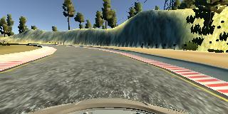

## Project Files:
* model.py: python code to create and train a model
* drive.py: code to drive a car in autonomous mode (in the simulator!)
* model.h5 and model.json: A fitted model that behaves well in the autonomous mode (again in the simulator!)
* README.md: An overview of the model

## Model Architecture:
I tried a couple of models here.
* [Comma.ai steering model](https://github.com/commaai/research/blob/master/train_steering_model.py) : This is a straightforward model that uses 3 convolutional layers followed by a fully connected dense layer that finally feeds into the output layer.
* [NVidia self steering model](https://images.nvidia.com/content/tegra/automotive/images/2016/solutions/pdf/end-to-end-dl-using-px.pdf): This is the model I went with, so will describe in detail:
  1. The first layer is a normalizing layer to bring pixel values to the range [0, 1]. This is done by dividing all pixel values in each channel by 255. 
  2. A 2D convolution layer of size 5x5 with subsampling/stride of (2, 2). I go with 24 output layers.
  3. A ReLU activation layer
  4. A 2D convolution layer of size 5x5 again, with subsample/stride of (2, 2). I go with 36 output layers.
  5. A ReLU activation layer
  6. A 2D convolution layer of size 5x5, subsampling (2, 2) and 48 output layers.
  7. A ReLU activation layer
  8. A 2D convolution layer of size 3x3, subsampling (2, 2) and 64 output layers.
  9. A flatten layer, so we can feed the output to a fully connected layer.
  10. We add drop-out regularization, with a drop-out percentage of 0.2
  11. A ReLU activation layer
  12. A fully connected layer with 1164 output layers.
  13. A drop out layer with drop-out percentage of 0.2
  14. An exponential linear unit activation layer
  15. A fully connected layer with 100 output layers.
  16. A dropout layer with 20% drop out.
  17. An ELU activation layer
  18. A fully connected layer with 50 output layers
  19. A dropout layer with 20% drop out
  20. An ELU activation layer
  21. A fully connected layer with 10 output layers
  22. A dropout layer with 20$ drop out
  23. An ELU activation layer
  24. A fully connected layer with 1 output

We use Adam optimizer for training the model. The default implementation starts with a learning rate of 0.001. If we are `tuning` a pre-existing model, we start with a learning rate of 0.0001 instead.

In both the architectures, convolution layers can be thought of as feature extractors that are used by the fully connected layers, which act as regression layer. 

### Training Strategy:
I try to reduce over-fitting by employing 3 strategies:
  1. Train-test split: We split the training set into training and validation set. Validation set gives an idea of the model performance on out-of-sample data.
  2. Dropout layers: This is to randomly drop-out portion of the output of a layer, during a training pass.
  3. We randomly mirror a batch of data, this way introducing some more randomness into training and also supplementing training data. This proved useful for the test track, as most of the turns are left turns, and the model gets a chance to learn when to turn right as well.

The final model is tested on the track. 

### Training data:
Data generation for this exercise is a little hard. Running the simulator with keyboard input doesn't really generate enough variability in the steering angles for it to be usable for training the network. Using the beta-simulator, that allows using a mouse based input goes a long way in improving the training data. Generating training data with a joystick would be even better, but I did not have access to one. 

Training data was generated in two ways. First, enough data was generated where we try to stay in the middle of the road, as best as we can. This forms a good baseline dataset to start training a model. If a candidate model can go past the first couple of turns using this data, we proceed with using the candidate model. The images look like the following:

The dataset is augmented with more training data where we start the car on the edge or a little outside the edge and make our way to the middle of the road. This dataset helps in teaching the model to recover in case it goes a little off to the side. Both the first and the second datasets are shuffled and the model is training using this data. These images look like the following:

Once this training is complete, we then start fine tuning the model, by now passing the same data with random mirror-ing. The angles for mirrored images are negated. This improves the model performance. These images look like the following:

